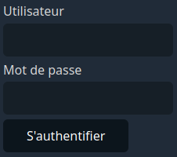
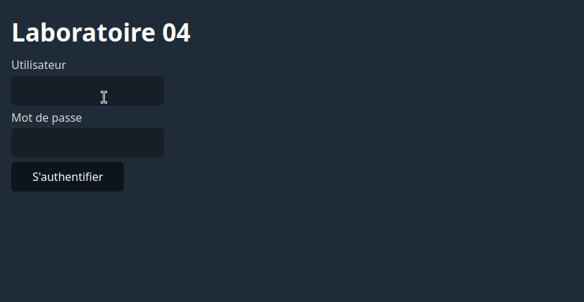
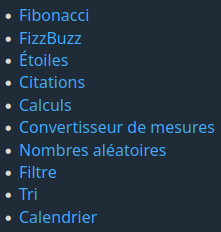

# Laboratoire 04

## Objectif

* Mettre en pratique la création et l'utilisation des fonctions
* Mettre en pratique la structure conditionnelle *switch*
* Réinvestir toutes les notions vues depuis le début de la session

## Prérequis

Clonez ce dépôt à la racine du répertoire contenant les fichiers Web de votre serveur Apache. Utilisez ensuite un navigateur Web pour accéder à l'adresse `/lab04` sur votre serveur local.

Vous devriez voir une page avec le titre « Laboratoire 04 ».

Ouvrez ensuite le dossier `lab04` dans votre IDE. Prenez connaissance des fichiers qu'il contient. Vous constaterez qu'il y a un fichier `index.php` (page d'accueil du laboratoire) ainsi que des sous-dossier `pages` et `fonctions` contenant plusieurs autres fichiers PHP.

## 1 - Création de la page d'accueil

Prenez connaissance du code du fichier `index.php`. Vous constaterez que celui-ci inclut les fichiers `fonctions/authentification.php` et `fonctions/menu.php` à l'aide de la fonction `require_once`. Vous verrez aussi qu'il appelle à différents endroits les fonctions `deconnecter`, `estAuthentifie`, `obtenirInfoUtilisateur`, `afficherFormulaireAuthentification` et `afficherMenu`. Ces différentes fonctions sont définies dans l'un ou l'autre des deux fichiers inclus. Elles sont présentement vides. Vous allez implémenter leurs corps dans les étapes qui suivent.

### 1.1 - Fonctions d'authentification

Ouvrez le fichier `fonctions/authentification.php`. Celui-ci contient quatre fonctions à compléter:

* `estAuthentifie`
* `obtenirInfoUtilisateur`
* `afficherFormulaireAuthentification`
* `deconnecter`

Complétez ces quatre fonctions en suivant la logique suivante pour chacune:

**Fonction `estAuthentifie` :**

* SI la variable de session `utilisateur` existe:
    
    * Retourner `true`

* SINON SI les champs de formulaire `utilisateur` et `mot_de_passe` ont été reçus:

    * SI l'utilisateur est `bob` et que le mot de passe est `abc123`:

        * Créer la variable de session `utilisateur` contenant le tableau associatif `['prenom' => 'Bob', 'nom' => "L'Éponge"]`
        * Retourner `true`
* Retourner `false`

**Fonction `obtenirInfoUtilisateur` :**

* SI `estAuthentifie()`:
    
    * Retourner la variable de session `utilisateur`

* Retourner `null`

**Fonction `afficherFormulaireAuthentification` :**

* SI le champ de formulaire `utilisateur` a été reçu et que `estAuthentifie()` est faux:

    * Afficher `Utilisateur ou mot de passe invalide.`

* Afficher le formulaire suivant:

    * 

**Fonction `deconnecter` :**

* Supprimer la variable de session `utilisateur`

Vous n'avez rien à modifier dans le fichier `index.php` pour le moment. Une fois que vous aurez implémenté correctement toutes les fonctions ci-dessus, vous obtiendrez le comportement suivant pour la page d'accueil:

Assurez-vous que vous obtenez bien les résultats ci-dessus avant de continuer.

### 1.2 - Fonction d'affichage du menu

Observez la structure conditionnelle dans le bas du fichier `index.php`. On peut y constater que si l'utilisateur est authentifié et que la variable `$_GET['page']` n'existe pas, alors la fonction `afficherMenu` est appelée.

La fonction `afficherMenu` est définie dans le fichier `fonctions/menu.php`, mais est présentement vide. Vous devez lui ajouter le code nécessaire pour afficher le menu ci-dessous:

Plutôt que faire pointer chaque lien vers un fichier PHP différent, vous lui ferez recharger la page courante avec une valeur différente du paramètre d'URL `page`. Voici donc la cible (`href`) à utiliser pour chaque lien:

| Lien                        | Cible                         |
|-----------------------------|-------------------------------|
| Fibonacci                   | `?page=fibonacci`             |
| FizzBuzz                    | `?page=fizbuzz`               |
| Étoiles                     | `?page=etoiles`               |
| Citations                   | `?page=citations`             |
| Calculs                     | `?page=calculs`               |
| Convertisseur de mesures    | `?page=conversion`            |
| Nombres aléatoires          | `?page=nombre-aleatoires`     |
| Filtre                      | `?page=filtre`                |
| Tri                         | `?page=tri`                   |
| Calendrier                  | `?page=calendrier`            |

Encore une fois, vous ne devez rien modifier dans le fichier `index.php`. Si vous implémentez la fonction `afficherMenu` correctement, le menu apparaîtra sur la page d'accueil.

### 1.3 - Chargement de la bonne page
