# Laboratoire 04

## Objectif

* Mettre en pratique la création et l'utilisation des fonctions
* Mettre en pratique la structure conditionnelle *switch*
* Réinvestir toutes les notions vues depuis le début de la session

## Prérequis

Clonez ce dépôt à la racine du répertoire contenant les fichiers Web de votre serveur Apache. Utilisez ensuite un navigateur Web pour accéder à l'adresse `/lab04` sur votre serveur local.

Vous devriez voir une page vide avec le titre « Laboratoire 04 ».

Ouvrez ensuite le dossier `lab04` dans votre IDE. Prenez connaissance des fichiers qu'il contient. Vous constaterez qu'il y a un fichier `index.php` (page d'accueil du laboratoire) ainsi que des sous-dossier `pages` et `fonctions` contenant plusieurs autres fichiers PHP.

## 1 - Création de la page d'accueil

Prenez connaissance du code du fichier `index.php`. Vous constaterez que celui-ci inclut les fichiers `fonctions/authentification.php` et `fonctions/menu.php` à l'aide de la fonction `require_once`. Vous verrez aussi qu'il appelle à différents endroits les fonctions `deconnecter`, `estAuthentifie`, `obtenirInfoUtilisateur`, `afficherFormulaireAuthentification` et `afficherMenu`. Ces différentes fonctions sont définies dans l'un ou l'autre des deux fichiers inclus. Elles sont présentement vides. Vous allez implémenter leurs corps dans les étapes qui suivent.

### 1.1 - Fonctions d'authentification

Ouvrez le fichier `fonctions/authentification.php`. Celui-ci contient quatre fonctions à compléter:

* `estAuthentifie`
* `obtenirInfoUtilisateur`
* `afficherFormulaireAuthentification`
* `deconnecter`

Complétez ces quatre fonctions en suivant la logique suivante pour chacune:

**Fonction `estAuthentifie` :**

* SI la variable de session `utilisateur` existe:
    
    * Retourner `true`

* SINON SI les champs de formulaire `utilisateur` et `mot_de_passe` ont été reçus:

    * SI l'utilisateur est `bob` et que le mot de passe est `abc123`:

        * Créer la variable de session `utilisateur` contenant le tableau associatif `['prenom' => 'Bob', 'nom' => "L'Éponge"]`
        * Retourner `true`
* Retourner `false`

**Fonction `obtenirInfoUtilisateur` :**

* SI `estAuthentifie()`:
    
    * Retourner la variable de session `utilisateur`

* Retourner `null`

**Fonction `afficherFormulaireAuthentification` :**

* SI le champ de formulaire `utilisateur` a été reçu et que `estAuthentifie()` est faux:

    * Afficher `Utilisateur ou mot de passe invalide.`

* Afficher le formulaire suivant:

    * 

**Fonction `deconnecter` :**

* Supprimer la variable de session `utilisateur`

Vous n'avez rien à modifier dans le fichier `index.php` pour le moment. Une fois que vous aurez implémenté correctement toutes les fonctions ci-dessus, vous obtiendrez le comportement suivant pour la page d'accueil:


Assurez-vous que vous obtenez bien les résultats ci-dessus avant de continuer.

### 1.2 - Fonction d'affichage du menu

Observez la structure conditionnelle dans le bas du fichier `index.php`. On peut y constater que si l'utilisateur est authentifié et que la variable `$_GET['page']` n'existe pas, alors la fonction `afficherMenu` est appelée.

La fonction `afficherMenu` est définie dans le fichier `fonctions/menu.php`, mais est présentement vide. Vous devez lui ajouter le code nécessaire pour afficher le menu ci-dessous:


Plutôt que faire pointer chaque lien vers un fichier PHP différent, vous lui ferez recharger la page courante avec une valeur différente du paramètre d'URL `page`. Voici donc la cible (`href`) à utiliser pour chaque lien:

| Lien                        | Cible                         |
|-----------------------------|-------------------------------|
| Fibonacci                   | `?page=fibonacci`             |
| FizzBuzz                    | `?page=fizzbuzz`              |
| Étoiles                     | `?page=etoiles`               |
| Citations                   | `?page=citations`             |
| Calculs                     | `?page=calculs`               |
| Convertisseur de mesures    | `?page=conversion`            |
| Nombres aléatoires          | `?page=nombre-aleatoires`     |
| Filtre                      | `?page=filtre`                |
| Tri                         | `?page=tri`                   |
| Calendrier                  | `?page=calendrier`            |

Encore une fois, vous ne devez rien modifier dans le fichier `index.php`. Si vous implémentez la fonction `afficherMenu` correctement, le menu apparaîtra sur la page d'accueil.

### 1.3 - Chargement de la bonne page

Dans le `else if` de la structure conditionnelle dans le bas du fichier `index.php`, vous trouverez le commentaire suivant:

```php
/****** AJOUTEZ LE SWITCH CI-DESSOUS *******/
```

Sous ce commentaire, vous devez créer la structure conditionnelle `switch` nécessaire pour **inclure** le bon fichier PHP selon la valeur de `$_GET['page']`. C'est ce qui permettra de faire fonctionner les liens du menu créé à l'étape précédente.

Les fichiers à inclure se trouvent dans le dossier `pages`. Le cas `default` doit afficher le texte `ERREUR: Page inexistante.`.

Voici le comportement attendu une fois que votre `switch` sera entièrement fonctionnel:

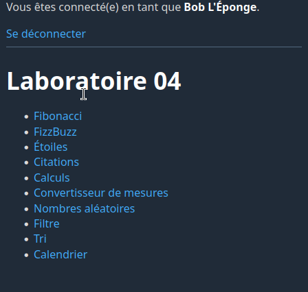

## 2 - Fibonacci

Ouvrez le fichier `pages/fibonacci.php`.

Vous constaterez que celui-ci ne contient qu'une balise `<h1>`. Les balises HTML de base (`html`, `head` et `body`) ne sont pas présentes. C'est parce qu'on n'accède pas à ce fichier directement: il est inclus dans le `body` du fichier `index.php`. On inclut donc seulement les balises qui doivent apparaître dans ce dernier. Souvenez-vous qu'inclure une page revient à faire un copier-coller de son contenu.

Dans ce fichier, ajoutez une fonction `afficherFibonacci` qui prend en paramètre le nombre de valeurs de la suite de Fibonacci à afficher. La fonction doit afficher ces valeurs dans une liste ordonnée (`ol`).

Créez aussi une fonction `afficherFormulaire` qui affiche le formulaire ci-dessous:

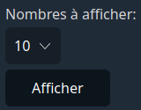

Cette fonction doit prendre en paramètre la valeur maximale à inclure dans la liste déroulante, ainsi qu'une valeur par défaut.

Ajoutez ensuite la logique suivante pour générer le contenu de la page:

* SI le champ de formulaire `nombre` a été reçu:

    * Appeler `afficherFibonacci` en lui passant la valeur du champ `nombre`

* SINON:

    * Appeler `afficherFibonacci` en lui passant `10`

* Appeler `afficherFormulaire` avec la valeur maximale `50` et la valeur par défaut `10`

Il reste à valider le champ du formulaire. Pour ce faire, créez une fonction `validerNombreEntier` dans le fichier `fonctions/validation.php`. Cette fonction doit prendre en paramètre un nombre, une valeur minimale et une valeur maximale, et retourner `true` si le nombre est valide (est un nombre entier) et compris entre `min` et `max` inclusivement. Autrement, elle doit retourner `false`.

Ajoutez ensuite une inclusion de `fonctions/validation.php` dans le fichier `pages/fibonacci.php`, et utilisez la fonction `validerNombreEntier` pour valider le champ du formulaire. Voici la logique mise à jour pour la page:

* SI le champ de formulaire `nombre` a été reçu **et est un nombre entier compris entre 1 et 50**:

    * Appeler `afficherFibonacci` en lui passant la valeur du champ `nombre`

* SINON:

    * Appeler `afficherFibonacci` en lui passant `10`

* Appeler `afficherFormulaire` avec la valeur maximale `50` et la valeur par défaut `10`

> N'hésitez pas à réutiliser votre fonction `validerNombreEntier` dans les autres étapes du laboratoire!

## 3 - FizzBuzz

Ouvrez le fichier `pages/fizzbuzz.php`.

Dans ce fichier, ajoutez une fonction `fizzBuzz` qui prend en paramètre deux nombres entiers et affiche dans une liste ordonnée (`ol`) les valeurs de FizzBuzz comprises entre ces deux nombres.

Créez aussi une fonction `afficherFormulaire` qui affiche le formulaire ci-dessous :

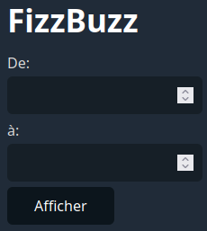

Utilisez ensuite ces fonctions pour produire le résultat ci-dessous. N'oubliez pas de valider les champs du formulaire. Les deux nombres doivent être entiers, être compris entre 1 et 1000, et la valeur « De » doit être inférieure à la valeur « À ».


## 4 - Étoiles

Dans le fichier `pages/etoiles.php`, vous devez créer les 6 fonctions suivantes:

* `triangleHautGauche`
* `triangleHautDroite`
* `triangleBasGauche`
* `triangleBasDroite`
* `afficherMotif`
* `afficherFormulaire`

La fonction `triangleHautGauche` doit prendre en paramètre un nombre de lignes et **retourner** (et non afficher!) un triangle d'étoiles semblable à celui ci-dessous, selon le nombre de lignes (dans l'exemple, le nombre de lignes est de 5):

```
        * 
      * * 
    * * * 
  * * * * 
* * * * *
```

Les fonctions `triangleHautDroite`, `triangleBasGauche` et `triangleBasDroite` prennent le même paramètre et retournent respectivement des triangles semblables à ceux-ci:

```
*
* *
* * *
* * * *
* * * * * 
```

```
* * * * * 
  * * * * 
    * * * 
      * * 
        *
```

```
* * * * *
* * * *
* * *
* *
* 
```

La fonction `afficherMotif` prend en paramètre le nombre de lignes par triangle, et appelle les quatre fonctions ci-dessus pour **afficher** (et non retourner) les quatre triangles dans un tableau HTML de 2x2. La page contient déjà du CSS pour désactiver les bordures du tableau. Le résultat doit ressembler à ceci:


La fonction `afficherFormulaire` doit prendre en paramètre un nombre de lignes par défaut, et afficher le formulaire suivant (dans l'exemple, le nombre de lignes par défaut est 5):

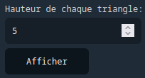

La logique de la page doit appeler la fonction `afficherMotif` avec la bonne valeur de paramètre (soit le nombre saisi dans le formulaire, soit la valeur par défaut de 5), puis afficher le formulaire. Le formulaire doit utiliser comme valeur par défaut la valeur précédémment saisie, ou bien 5 si aucune valeur n'a été saisie.

> Astuce: utilisez un opérateur ternaire pour appeler la fonction `afficherFormulaire` avec le bon paramètre, par exemple: `afficherFormulaire(isset($_POST['nombreLignes']) ? $_POST['nombreLignes'] : 5);
`

Voici le résultat attendu:

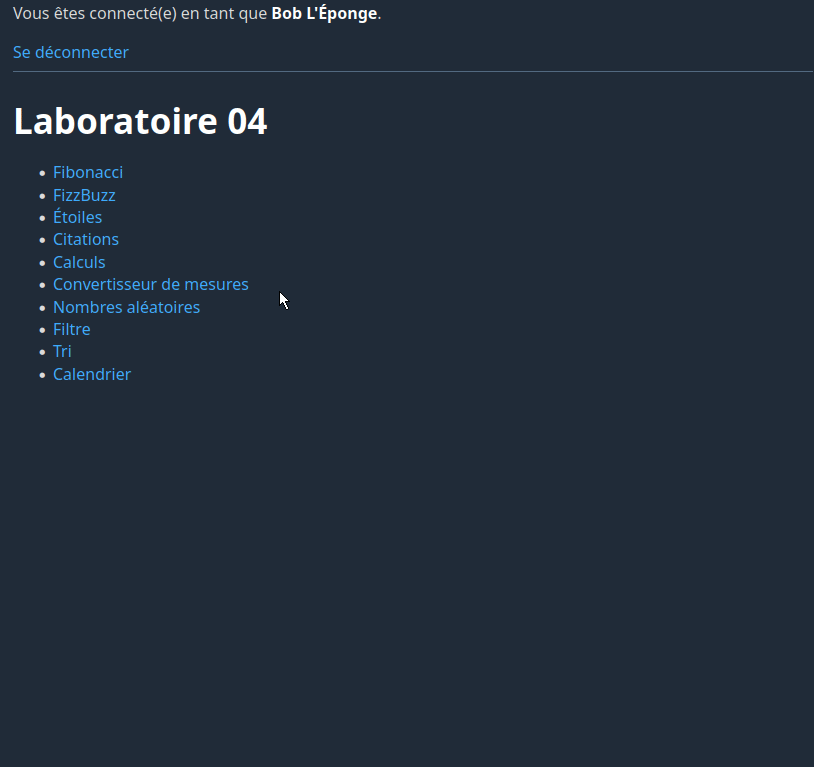

N'oubliez pas de valider les champs du formulaire.

## 5 - Citations

Dans le fichier `pages/citations.php`, créez une fonction qui retourne une citation au hasard. Utilisez cette fonction pour créer une page semblable à celle-ci:

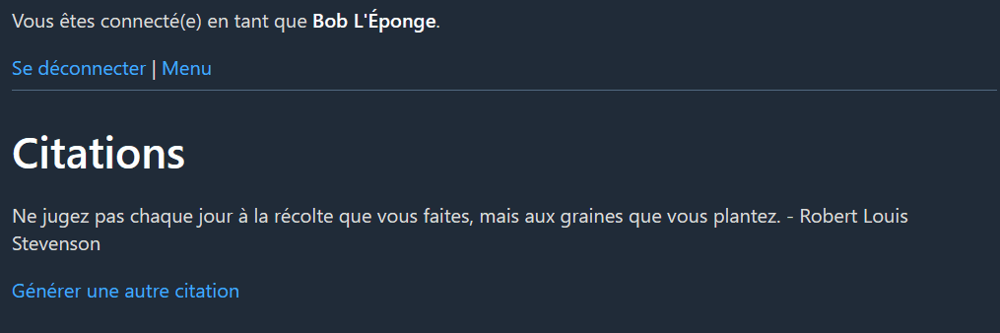

Pour rappel, voici comment récupérer une valeur au hasard dans un tableau:

```php
$tableau[array_rand($tableau)]
```

Voici un tableau de citations que vous pouvez utiliser dans votre fonction (gracieuseté d'une intelligence artificielle générative 😉):

```php
$citations = [
    'La vie, c\'est comme une boîte de chocolats, on ne sait jamais sur quoi on va tomber. - Forrest Gump',
    'Il n\'y a qu\'une façon d\'échouer, c\'est d\'abandonner avant d\'avoir réussi. - Olivier Lockert',
    'La seule limite à notre épanouissement de demain sera nos doutes d\'aujourd\'hui. - Franklin D. Roosevelt',
    'L\'imagination est plus importante que le savoir. - Albert Einstein',
    'La meilleure façon de prédire l\'avenir est de le créer. - Peter Drucker',
    'Le succès n\'est pas final, l\'échec n\'est pas fatal : c\'est le courage de continuer qui compte. - Winston Churchill',
    'La créativité, c\'est l\'intelligence qui s\'amuse. - Albert Einstein',
    'Ne jugez pas chaque jour à la récolte que vous faites, mais aux graines que vous plantez. - Robert Louis Stevenson'
];
```

## 6 - Calculs

Dans le fichier `pages/calculs.php`, commencez par créer une fonction `calculerSomme` qui prend en paramètre un tableau de nombres et retourne la somme de toutes ses valeurs, ainsi qu'une fonction `calculerMoyenne` qui prend en paramètre un tableau de nombres et retourne la moyenne de toutes ses valeurs.

> Note: vous auriez avantage à appeler votre fonction `calculerSomme` dans votre fonction `calculerMoyenne`.

Faites en sorte que la page affiche un formulaire avec un `textarea`. L'utilisateur doit entrer une liste de nombres dans ce `textarea`, en faisant un saut de ligne dans chaque nombre.

Utilisez la fonction suivante pour convertir le contenu du `textarea` en tableau de nombres entiers:

```php
function traiterTextArea($textarea) {
    $nombres = [];
    $lignes = explode("\n", $textarea);
    foreach ($lignes as $ligne) {
        $nombres[] = (float)$ligne;
    }
    return $nombres;
}
```

Assurez-vous de bien comprendre le code de la fonction `traiterTextArea`. La fonction `explode`, qu'elle utilise, permet de convertir une chaîne de caractères en tableau de chaînes de caractères en fonction d'un séparateur. Dans le code ci-dessus, le séparateur est `\n`, c'est-à-dire le saut de ligne. Chacune des valeurs qui ont été saisies dans le `textarea` et séparées par des sauts de ligne deviendra donc un élément distinct du tableau `$nombres`.

Passez le résultat de `traiterTextArea` à vos fonctions `calculerSomme` et `calculerMoyenne` afin d'obtenir la somme et la moyenne des nombres saisis.

Voici le résultat attendu:

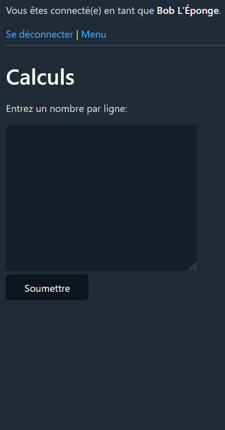

## 7 - Convertisseur de mesures

Dans le fichier `pages/conversion.php`, créez les fonctions suivantes:

* `convertirKgEnLb`, qui prend en paramètre un poids en kilogrammes et retourne le poids en livres correspondant;
* `convertirLbEnKg`, qui fait l'inverse;
* `convertirCmEnPouces`, qui prend une taille en centimères et retourne la taille en pouces correspondante;
* `convertirPoucesEnCm`, qui fait l'inverse.

Faites des recherches sur le Web pour trouver les formules mathématiques à utiliser dans vos fonctions.

Votre objectif est de reproduire la page suivante:

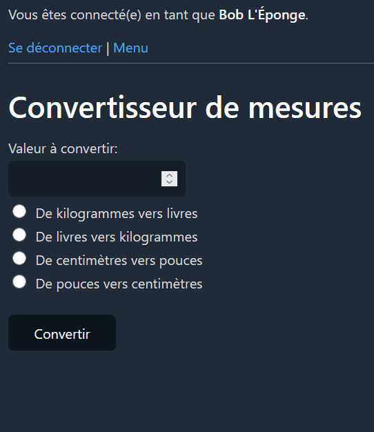

Créez une fonction `afficherFormulaire` pour générer le formulaire.

Il faut valider les champs du formulaire. Pour la validation de la valeur à convertir, on veut accepter les nombres à virgule. Vous pouvez donc créer une nouvelle fonction `validerNombre` qui, contrairement à `validerNombreEntier`, vérifie si la valeur est un nombre, sans vérifier qu'il s'agit d'un nombre entier.

> 🤔 Est-ce que la fonction `validerNombreEntier` pourrait appeler la fonction `validerNombre` ?

Il faut aussi valider que la valeur choisie avec les boutons radio existe. Vous pourriez pour cela ajouter la fonction suivante dans le fichier `fonctions/validation.php`:

```php
function validerValeurChoix($valeur, $choixPossibles) {
    return in_array($valeur, $choixPossibles);
}
```

Cette fonction prend en paramètre la valeur à valider et un tableau contenant les choix possibles, et retourne `true` si la valeur se trouve parmi ces choix.

## 8 - Nombres aléatoires

Dans le fichier `pages/nombres-aleatoires.php`, créez une fonction `genererNombreAleatoires`. La fonction doit prendre en paramètres une valeur minimale, une valeur maximale et une quantité. Elle doit retourner un tableau contenant la quantité demandée de nombres générés aléatoirement entre la valeur minimale et la valeur maximale. Pour ce faire, vous aurez besoin de la fonction [rand](https://www.php.net/manual/fr/function.rand.php) de PHP.

Vous devez afficher le formulaire suivant:

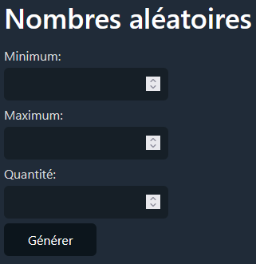

Votre code doit appeler votre fonction `genererNombresAleatoires` en lui passant les valeurs des champs du formulaire. 

Vous devez ensuite afficher les nombres aléatoires générées dans une liste `ul`. Pour ce faire, créez une nouvelle fonction `afficherListe` qui prend en paramètre le type de liste (`ul` ou `ol`) et un tableau de valeurs et affiche la liste correspondante. Placez cette fonction dans un nouveau fichier `fonctions/afficherListe.php`. Vous réutiliserez cette fonction dans une étape ultérieure du laboratoire.

Voici le résultat attendu:

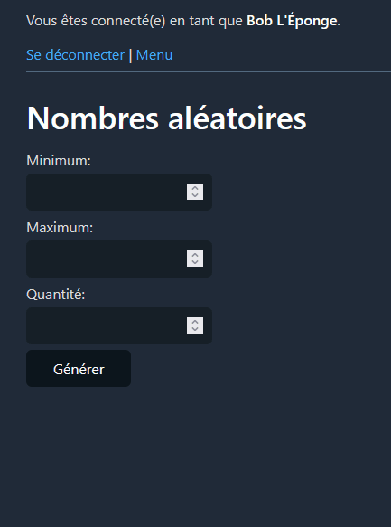

## 9 - Filtre

Dans le fichier `pages/filtre.php`, vous devez reproduire le comportement suivant:

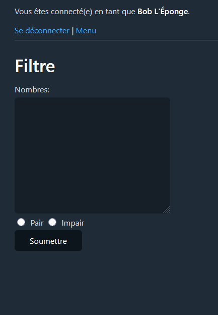

Pour ce faire, commencez par créer les cinq fonctions suivantes:

* `filtrerModulo`
* `filtrerPair`
* `filtrerImpair`
* `traiterTextArea`
* `traiterFormulaire`

La fonction `filtrerModulo` prend trois paramètres: `$nombres`, `$modulo` et `$resultatModulo`. Elle retourne un nouveau tableau contenant uniquement les valeurs de `$nombres` dont le résultat du modulo par `$modulo` est `$resultatModulo`. Par exemple, si `$modulo` est 4 et que `$resultatModulo` est 3, seuls les nombres dont la valeur modulo 4 est égale à 3 seront retournés.

La fonction `filtrerPair` utilise la fonction `filtrerModulo`. Elle reçoit  un tableau de nombres et retourne seulement les valeurs paires de ce tableau.

La fonction `filtrerImpair` utilise aussi la fonction `filtrerModulo`. Elle reçoit un tableau de nombres et retourne seulement les valeurs impaires de ce tableau.

La fonction `traiterTextArea` est la même qu'à l'étape **6 - Calculs**, à l'exception qu'elle convertit les valeurs en `int` plutôt qu'en `float`.

La fonction `traiterFormulaire`, pour sa part, appelle `traiterTextArea` pour obtenir le tableau de nombres, puis appelle la bonne fonction pour filtrer le contenu du tableau selon que le bouton radio **Pair** ou **Impair** est sélectionné. Elle retourne le tableau filtré.

Complétez le code en utilisant vos fonctions pour obtenir le résultat attendu. La fonction `afficherListe` codée à l'étape précédente vous sera utile.

## 10 - Tri

Utilisez la fonction [asort](https://www.php.net/manual/en/function.asort.php) pour reproduire le comportement suivant dans `pages/tri.php`:

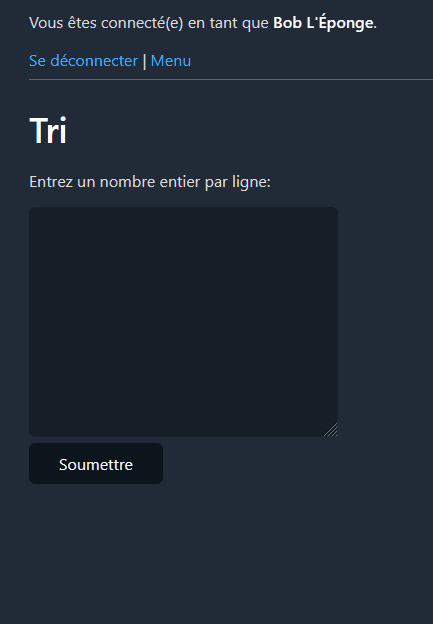

## 11 - Calendrier

Voici un petit défi pour finir!

Votre mission, si vous l'acceptez, est de reproduire la page suivante qui affiche un calendrier:

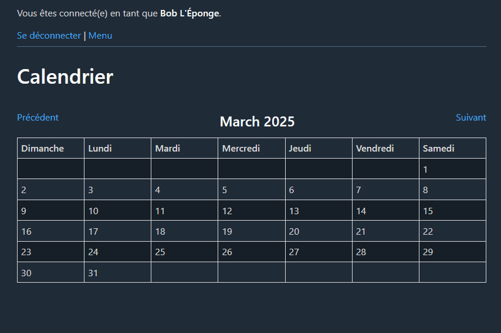

Par défaut, le calendrier du mois courant doit être affiché.

Vous devez créer une fonction `construireCalendrier` qui retourne une chaîne de caractères permettant d'afficher le calendrier. Voici des exemples d'appels de fonctions de PHP qui vous seront utiles pour créer votre fonction:

```php
// Obtenir le nombre de jours du mois de mars 2025
$nbJours = cal_days_in_month(CAL_GREGORIAN, 3, 2025);

// Obtenir le jour de la semaine du premier jour du mois spécifié (0 = dimanche, 6 = samedi)
$premierJour = date("w", mktime(0, 0, 0, $mois, 1, $annee));

// Obtenir le jour de la semaine du dernier jour du mois spécifié (0 = dimanche, 6 = samedi)
$dernierJour = date("w", mktime(0, 0, 0, $mois, $nbJours, $annee));
```

Voici comment obtenir le numéro du mois courant:

```php
$mois = date('n');
```

Voici comment obtenir l'année courante:

```php
$annee = date('Y');
```

> SUGGESTION: armez-vous d'un papier et d'un crayon pour penser votre logique avant d'essayer de coder votre fonction `construireCalendrier`.

Bonne chance!
